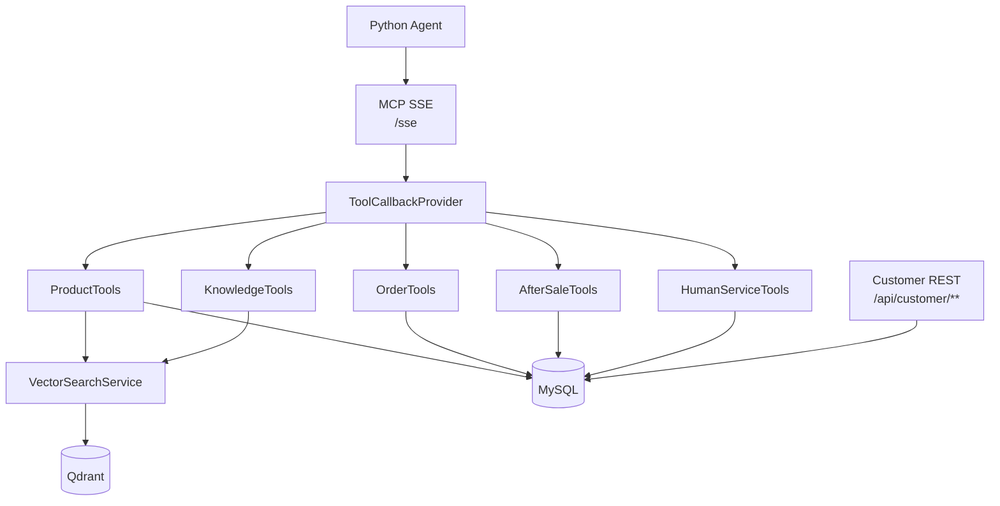

# MCP Server

数码商城智能客服的工具层，基于 Spring Boot 和 Spring AI MCP Server 构建。它把商品、订单、物流、售后、知识库、人工服务等后端能力封装为 MCP 工具，供 Python Agent 调用。

## 职责

- 提供 MCP SSE 端点：`/sse`。
- 提供商品搜索和商品详情工具。
- 提供订单查询、物流查询、创建订单等工具。
- 提供售后查询、创建售后、人工服务单等工具。
- 提供售后知识库检索工具。
- 提供前端自助页面使用的订单、售后 REST 接口。
- 管理 MySQL 种子数据和 Qdrant 商品/知识库索引。

## 工具架构



## 存储划分

| 存储 | 用途 |
| --- | --- |
| MySQL | 客户、商品库存、订单、售后、人工服务等权威业务数据。 |
| Qdrant | 商品详情和售后知识库的向量检索集合。 |
| Redis | 缓存和其他运行态数据，主要配合整体系统使用。 |

Qdrant 集合：

- `digital_cs_products`：商品详情语义检索。
- `digital_cs_knowledge`：售后技术知识库语义检索。

## MCP 工具

| 工具 | 说明 |
| --- | --- |
| `searchProducts` | 按需求检索和推荐商品。 |
| `getProductDetail` | 查询指定商品价格、库存、规格等详情。 |
| `queryOrder` | 查询指定订单详情。 |
| `listCustomerOrders` | 列出当前客户订单。 |
| `trackLogistics` | 查询订单物流轨迹。 |
| `createOrder` | 创建待付款订单，属于写操作，需要用户确认。 |
| `queryAfterSale` | 查询指定售后单。 |
| `listOrderAfterSales` | 查询某个订单关联的售后记录。 |
| `listCustomerAfterSales` | 列出当前客户售后申请。 |
| `createAfterSale` | 创建售后申请，属于写操作，需要用户确认。 |
| `createHumanService` | 创建人工服务单，属于写操作，需要用户确认。 |
| `searchKnowledge` | 检索售后政策、故障排查和使用知识。 |

## 快速开始

### Docker 一键启动

```bash
cd MCP
docker compose up -d
```

该命令会启动：

- MCP 应用：`http://localhost:8080`
- MySQL：宿主机 `3307`，容器内 `3306`
- Redis：`6379`
- Qdrant：`6333` / `6334`

导入商品和知识库索引：

```bash
curl -X POST http://localhost:8080/admin/reindex
```

### 本地开发启动

如果只想本地运行 Java 应用，可以单独准备 MySQL、Redis、Qdrant，然后运行：

```powershell
$env:DASHSCOPE_API_KEY = "sk-your-key"
$env:MYSQL_HOST = "localhost"
$env:MYSQL_PORT = "3307"
$env:MYSQL_DB = "digital_cs"
$env:MYSQL_USER = "root"
$env:MYSQL_PASSWORD = "root"
$env:QDRANT_HOST = "localhost"
$env:QDRANT_PORT = "6334"
```

```bash
mvn spring-boot:run
```

默认端口：`8080`。

## 管理接口

| 接口 | 说明 |
| --- | --- |
| `POST /admin/reindex` | 从种子 JSON 重建商品和知识库向量索引。 |
| `POST /admin/reset` | 重置示例业务数据。 |

## 前端自助接口

这些接口由 Gateway 转发给前端页面使用，身份来自网关注入的 `X-Customer-Id`。

| 接口 | 说明 |
| --- | --- |
| `GET /api/customer/orders` | 当前用户订单列表。 |
| `GET /api/customer/orders/{orderNo}` | 订单详情。 |
| `POST /api/customer/orders` | 创建待付款订单。 |
| `POST /api/customer/orders/{orderNo}/cancel` | 撤销待付款订单。 |
| `GET /api/customer/aftersales` | 当前用户售后列表。 |
| `GET /api/customer/aftersales/{afterSaleNo}` | 售后详情。 |
| `POST /api/customer/aftersales/{afterSaleNo}/cancel` | 撤销售后申请。 |

## 目录结构

```text
MCP/
├── docker-compose.yml
├── Dockerfile
├── pom.xml
├── mcp_test_client.py
└── src/main/
    ├── java/com/digitalcs/mcp/
    │   ├── entity/      # Customer / Product / Orders / AfterSale
    │   ├── mapper/      # MyBatis-Plus Mapper
    │   ├── service/     # 业务服务
    │   ├── tools/       # MCP 工具
    │   ├── vector/      # Qdrant 检索与写入
    │   └── web/         # 管理接口和前端自助 REST
    └── resources/
        ├── db/schema.sql
        └── seed/        # MySQL、商品、知识库种子数据
```

## 测试和验证

```bash
mvn test
```

验证 MCP 工具：

```bash
npx @modelcontextprotocol/inspector
# Transport: SSE
# URL: http://localhost:8080/sse
```

也可以使用仓库脚本：

```bash
python mcp_test_client.py
```
