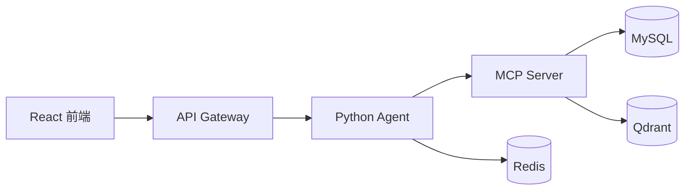

# 数码商城智能客服


面向数码商城场景的智能客服系统，覆盖售前推荐、订单查询、物流追踪、售后申请和技术答疑。系统由 React 前端、API Gateway、Python 多 Agent 服务和 MCP 工具服务组成。

## ✨ 核心能力

- **多 Agent 协作**：编排、商品、订单售后、技术支持、记忆总结等 Agent 分工处理。
- **流式客服体验**：前端通过 SSE 展示 Agent 思考与回复过程。
- **安全确认机制**：创建订单、售后申请、人工服务单等写操作先返回确认卡片。
- **分层记忆**：本地缓存、Redis、MySQL、Qdrant 分别承载运行态、近期上下文、消息记录和长期语义记忆。
- **Hybrid RAG**：商品与知识库检索结合关键词和向量召回。
- **自助服务页**：支持我的订单、我的售后、历史会话查看。

## 🧩 模块说明

| 模块 | 目录 | 说明 |
| --- | --- | --- |
| 前端应用 | [`前端/`](前端/) | React + TypeScript 客服界面。 |
| Python Agent | [`Agent/src/agent/`](Agent/src/agent/) | 多 Agent 编排、流式响应、记忆和人工确认。 |
| API Gateway | [`Agent/src/api-gateway/`](Agent/src/api-gateway/) | 登录鉴权、路由转发、身份透传、历史会话。 |
| MCP Server | [`MCP/`](MCP/) | 商品、订单、售后、知识库等工具服务。 |

## 🏗️ 架构概览



## 🚀 快速启动

按顺序启动各服务：

```bash
# 1. 基础服务与 MCP
cd MCP
docker compose up -d
curl -X POST http://localhost:8080/admin/reindex

# 2. Python Agent
cd ../Agent/src/agent
conda activate ai
pip install -r requirements.txt
python main.py --serve

# 3. API Gateway
cd ../api-gateway
mvn spring-boot:run

# 4. 前端
cd ../../../前端
npm install
npm run dev
```

常用地址：

| 服务 | 地址 |
| --- | --- |
| 前端 | `http://localhost:5173` |
| API Gateway | `http://localhost:8002` |
| Python Agent | `http://127.0.0.1:8001` |
| MCP Server | `http://localhost:8080` |
| Qdrant | `http://localhost:6333` |

## 🧪 测试

```bash
# 前端
cd 前端
npm test
npm run build

# Python Agent
cd ../Agent/src/agent
pytest

# Java 服务
cd ../../src/api-gateway
mvn test

cd ../../../MCP
mvn test
```

## 📚 文档入口

- [前端文档](前端/README.md)
- [后端总览](Agent/README.md)
- [Python Agent 文档](Agent/src/agent/README.md)
- [API Gateway 文档](Agent/src/api-gateway/README.md)
- [MCP Server 文档](MCP/README.md)

## 🧹 维护说明

- `target/`、`.pytest_cache/`、`__pycache__/`、日志文件等为本地生成产物，可随时清理。
- `.env`、IDE 配置、`node_modules/` 由本地环境使用，默认不纳入仓库。
- 业务数据种子位于 `MCP/src/main/resources/seed/`，重建索引用 `POST /admin/reindex`。
